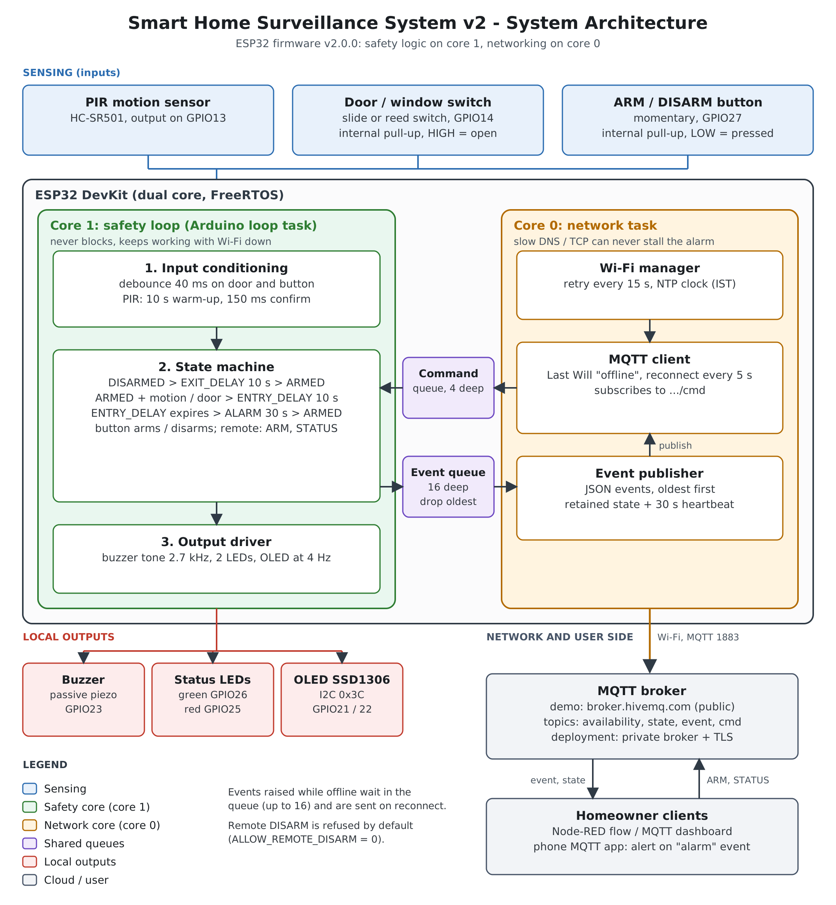
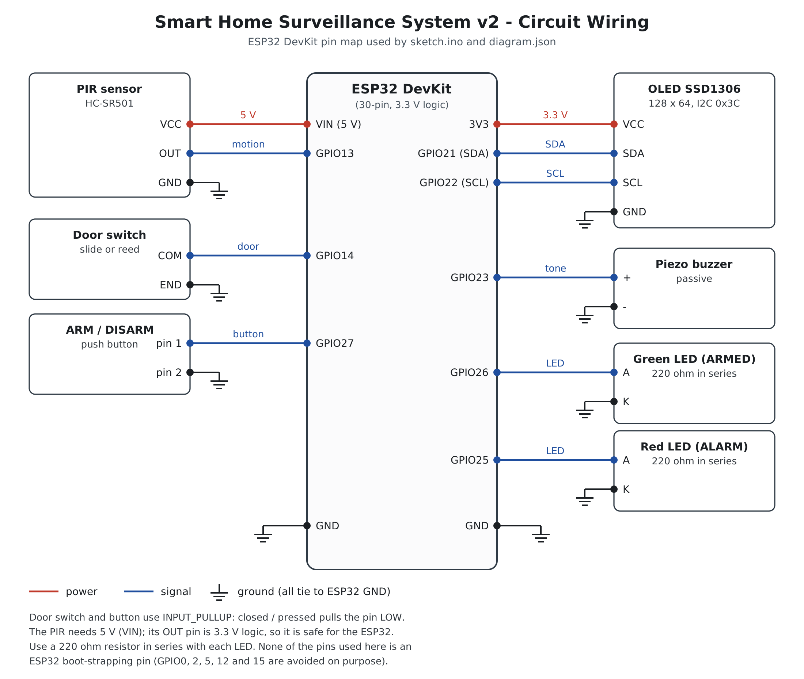

# Smart Home Automation: Surveillance System


An ESP32-based home surveillance system: motion and door sensing, a proper arm / disarm state machine with entry and exit delays, local siren and status display, and MQTT alerts. The alarm logic runs fully offline; networking lives in a separate FreeRTOS task so it can never stall the siren.

Developed as part of M.Tech coursework at SVNIT Surat.

## Features

- Arm / disarm with exit delay (10 s), entry delay (10 s) and alarm timeout (30 s)
- PIR motion sensing with warm-up, confirmation filter and rising-edge trigger
- Door switch and button inputs with debouncing
- Local outputs: buzzer, green (armed) and red (alarm) LEDs, SSD1306 OLED status screen
- MQTT: Last Will availability, retained state, heartbeat, per-event JSON, remote `ARM` / `STATUS`
- Offline event queue (16 deep) delivered in order after reconnect
- Non-blocking firmware: no `delay()` in the safety path, display failure does not halt the system
- Host-side unit tests run in CI

## Architecture



Safety logic runs on core 1 (Arduino loop). Wi-Fi, NTP and MQTT run on core 0 and talk to it only through two queues.

## Hardware



| GPIO | Part | Note |
|---|---|---|
| 13 | PIR OUT | PIR powered from VIN (5 V); OUT is 3.3 V logic |
| 14 | Door switch | `INPUT_PULLUP`, HIGH = open |
| 27 | ARM / DISARM button | `INPUT_PULLUP`, LOW = pressed |
| 23 | Buzzer | 2.7 kHz tone (passive piezo); set `BUZZER_ACTIVE 1` for an active buzzer |
| 26 | Green LED (ARMED) | 220 ohm series resistor |
| 25 | Red LED (ALARM) | 220 ohm series resistor |
| 21 / 22 | OLED SDA / SCL | SSD1306, address 0x3C |

## Quick start (Wokwi simulator)

1. Create a new ESP32 project at [wokwi.com](https://wokwi.com).
2. Replace its `sketch.ino` with `firmware/smart_home/smart_home.ino`, `diagram.json` with `wokwi/diagram.json`, and `libraries.txt` with `wokwi/libraries.txt`.
3. Start the simulation, click the ARM button, wait for `ARMED`, then click the PIR or toggle the door switch.

Required libraries: Adafruit SSD1306, Adafruit GFX Library, PubSubClient.

## MQTT interface

Topic root: `svnit/smarthome/<deviceId>/` (the device id is printed on the Serial Monitor at boot).

| Topic | Direction | Content |
|---|---|---|
| `availability` | device to broker, retained | `online` / `offline` (Last Will) |
| `state` | device to broker, retained | JSON: state, door, pir, rssi, counters, uptime |
| `event` | device to broker | JSON per event (`boot`, `exit_delay`, `armed`, `motion`, `door_open`, `door_closed`, `entry_delay`, `alarm`, `alarm_end`, `disarmed`, `cmd_rejected`, `cmd_ignored`) |
| `cmd` | broker to device | `ARM`, `STATUS` (`DISARM` only if `ALLOW_REMOTE_DISARM` is 1) |

Quick check: `mosquitto_sub -h broker.hivemq.com -t "svnit/smarthome/#" -v`

## Tests

```bash
./tests/host/run_tests.sh
```

Compiles the firmware against stubbed Arduino, FreeRTOS, Wi-Fi, MQTT and OLED layers and runs 10 scenarios at three `millis()` start values (including the 32-bit wrap), for both arduino-esp32 2.x and 3.x APIs. Covers the state machine, input filtering, remote commands, display failure, retry timing, offline queue ordering, overflow and JSON validity.

These tests check logic, not electrical behaviour. The Wokwi simulation and real hardware still need a manual check.

## Repository layout

```
firmware/smart_home/   ESP32 sketch (smart_home.ino)
wokwi/                 Wokwi circuit and library list
docs/images/           Architecture and wiring diagrams (PNG and SVG)
tests/host/            Host-side test harness and stubs
.github/workflows/     CI
```

## Security notes

- `broker.hivemq.com` is a public, unauthenticated demo broker. For real use run a private broker with username/password and TLS (port 8883), and keep credentials in an untracked `secrets.h`.
- Remote `DISARM` is disabled by default for the same reason.

## Roadmap

- Camera snapshot on alarm (ESP32-CAM)
- Notification consumer (Node-RED to Telegram or a phone MQTT app)
- Arduino CLI compile check in CI for the ESP32 target
- TLS and authenticated broker option in the firmware

## License

MIT, see [LICENSE](LICENSE).

## Author

MD Humayun, M.Tech (CSE, Information Security and Privacy), SVNIT Surat.
